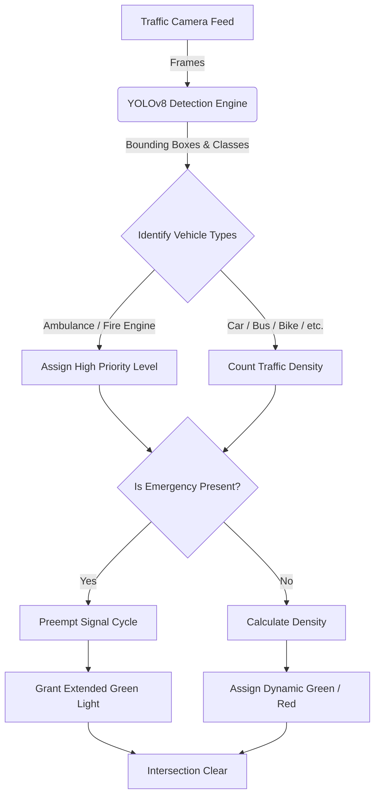

# Smart Traffic Signal System

### AI-Powered Dynamic Priority & Emergency Preemption

**Developed by:** _AMV0027_

---

# 🛑 Problem Statement

Urban traffic congestion is a multifaceted problem resulting in:

- **Delayed Emergency Responses:** Life-threatening delays for ambulances and fire engines stuck at red lights or in traffic.
- **Static Signal Inefficiencies:** Fixed-time traffic lights cannot adapt to real-time traffic volume, causing unnecessary wait times on empty roads.
- **Phantom Traffic Jams:** Human driving behavior (heavy braking, slow acceleration) naturally creates traffic waves.
- **Resource Wastage:** Increased fuel consumption, higher emissions, and lost economic productivity.

---

# 💡 Our Solution

A dynamic, intelligent traffic management system that fuses **Computer Vision** with **Physics-Based Simulation** to create a self-optimizing intersection.

**Core Pillars:**

1. **Vision-Based Awareness:** Real-time counting and classification of vehicles.
2. **Dynamic Tiered Priority:** Strict adherence to urgency (Ambulance > Fire Engine > Civilian).
3. **Physics-Driven Predictive Control:** Modeling traffic flow before assigning signal logic.
4. **Intelligent Routing:** Directing emergency vehicles through mathematically proven fastest paths.

---

# ⚙️ Technical Architecture

Our system leverages state-of-the-art technologies across a full-stack environment.

- **Frontend Component:** React, Vite, TailwindCSS
  - Provides a real-time, interactive simulation dashboard (visualized on HTML5 Canvas).
- **Backend Component:** Python, FastAPI
  - Handles heavy algorithmic computation and RESTful API endpoints.
- **AI / Computer Vision:** Ultralytics YOLOv8
  - Detects and categorizes 7 distinct vehicle classes at 30+ FPS.
- **Physics Engine:** Intelligent Driver Model (IDM)
  - Simulates realistic acceleration, deceleration, and gap-keeping.

---

# 🧠 Core Algorithms (1/2)

### 1. Priority-Based Preemption Engine

Signals dynamically reorder based on absolute urgency rather than simple presence.

- **Priority 5 (Highest):** Ambulances → Grants immediate 60-second green window.
- **Priority 3 (High):** Fire Engines → Grants immediate 45-second green window.
- **Priority 0 (Normal):** Civilian Vehicles → Grants default 30-second window + density bonuses.

### 2. YOLOv8 Real-Time Detection

Instead of relying on GPS or RFID, the system uses custom-trained YOLOv8 models on camera feeds to visually identify emergency vehicles with >90% confidence, triggering instant overrides.

---

# 🧠 Core Algorithms (2/2)

### 3. Intelligent Driver Model (IDM)

A continuous car-following algorithm that eliminates scripted "track" movements. Vehicles naturally form platoons, brake for red lights, and accelerate smoothly, creating realistic emergent traffic data for the signal logic to process.

### 4. Traffic-Weighted Dijkstra's Routing

Emergency vehicles don't just clear the immediate intersection; the underlying system calculates the fastest macro-route using Dijkstra's algorithm. Edge weights are not just physical distance, but _distance + real-time congestion penalty_.

---

# 🔄 System Flowchart

---

# 🔬 Identified Research & Inspiration

The foundation of this system is backed by modern traffic engineering and AI research:

1. **"Emergency Vehicle Preemption using YOLO"**
   - Focus: Utilizing YOLO object detection models for real-time identification of emergency vehicles to preempt traffic signals. _(Source: rjwave.org / IJFMR)_
2. **"AI-Based Smart Traffic Management Systems (STMS)"**
   - Focus: Dynamically controlling traffic signal timings using real-time traffic density to reduce congestion and wait times. _(Source: ResearchGate)_
3. **"Creating Green Corridors for Emergency Services"**
   - Focus: Advance route clearance and multi-intersection synchronization to mitigate delays and accident risks. _(Source: SlideShare)_

---

# 🎯 Conclusion & Future Scope

### Conclusion

The Smart Traffic Signal System successfully proves that combining deep learning vision models (YOLOv8) with robust physics engines (IDM) provides a scalable, false-positive resistant, and highly reactive solution to urban traffic management and emergency response.

### Future Scope

- **V2X Communication:** Integration with Vehicle-to-Everything protocols to communicate signal states directly to vehicle dashboards.
- **Multi-Node Synchronization:** Linking multiple intersections via localized mesh networks to create "Green Waves" extending for miles.
- **Reinforcement Learning:** Replacing the heuristic density logic with a Deep Q-Network (DQN) that trains itself on historical flow patterns.
